## ACTIVITY 3

**Author:** ADEWALE OLAOMO  
**Instructor:** Bobby Estey  
**Date:** 28 Feb 2026

---
# Introduction

**2. Part 1 – Project Setup and Responsive Grid**

**Project Initialization**

The first phase of this assignment involved creating a foundational Angular application using Angular CLI. The following command was used:

**ng new simpleapp**

During setup, routing was enabled and CSS was selected as the styling format. Enabling routing ensured that navigation functionality could be implemented later in the project.
After project creation, Bootstrap was integrated to enable responsive UI design and styling support. The following commands were executed:

npm install bootstrap
npm install @popperjs/core

The angular.json file was updated to include Bootstrap’s CSS and JavaScript bundles. This allowed the application to use Bootstrap components such as grid layouts, buttons, and responsive utilities.

**Responsive Grid Implementation**

The default app.component.html file was replaced with a structured Bootstrap grid layout. The purpose of this step was to demonstrate understanding of responsive web design principles.
Bootstrap grid classes such as:

- container
- row
- col
- col-md-*
- col-lg-*

were implemented to create a layout that adapts to different screen sizes.
Chrome Developer Tools device emulation was used to test responsiveness. The layout was verified across:
- Mobile view
- Tablet view
- Desktop view

**Skills Demonstrated in This Section**

- Angular CLI project initialization
- Bootstrap integration
- Editing angular.json configuration
- Responsive grid design
- Testing UI responsiveness using browser developer tools
- Understanding of mobile-first design principles

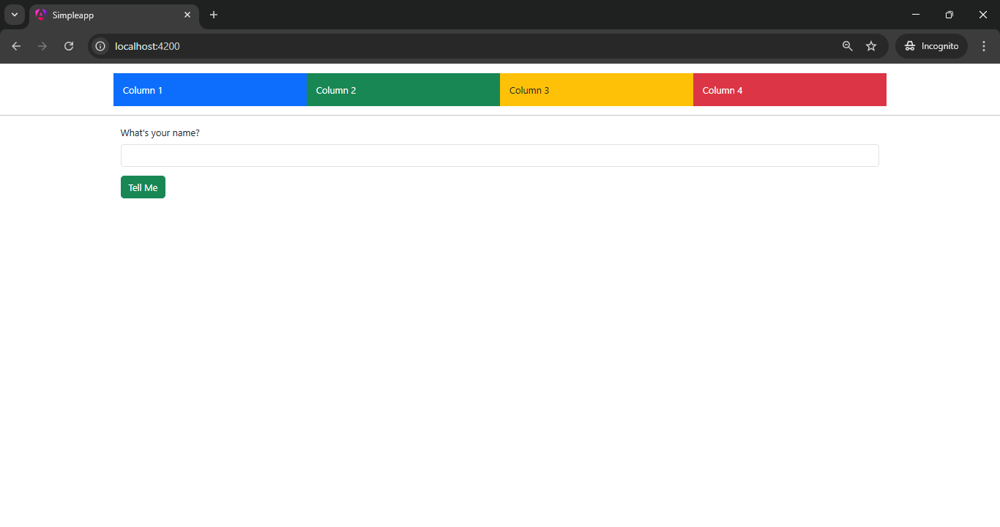
Bootstrap Grid Layout (Desktop View)

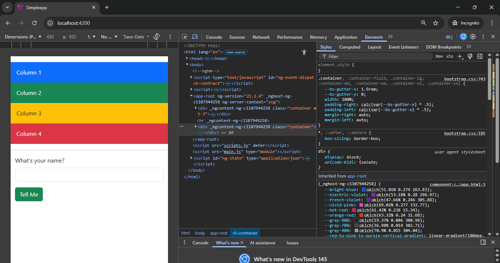
Bootstrap Grid Layout (Mobile View)

**Reactive Forms Implementation (Shop Component)**

**Component Generation**

The Shop component was generated using Angular CLI to demonstrate reactive form implementation. Reactive forms provide a model-driven approach to handling form inputs in Angular.
ReactiveFormsModule was imported into the application to enable reactive form functionality.

**Form Structure**

A FormGroup and FormControl were used to define the structure of the form programmatically inside the component class.
The form contains:

- A question label
- An input field bound to a FormControl
- A submit button

The FormGroup manages form state and validation logic within the TypeScript class rather than the template.

**Form Submission Logic**

When the user submits the form:
- The onSubmit() method is triggered.
- The entered value is retrieved using formGroup.value.
- The value is logged to the console.
- The UI updates dynamically using interpolation.
This demonstrates how reactive forms separate form logic from template design.

**Angular Concepts Demonstrated**

- ReactiveFormsModule usage
- FormGroup and FormControl
- Event binding using (ngSubmit)
- Interpolation for dynamic UI updates
- Form state management

Reactive forms are scalable and preferred for complex enterprise applications because they provide:
- Better testability
- Explicit form model control
- Easier validation handling

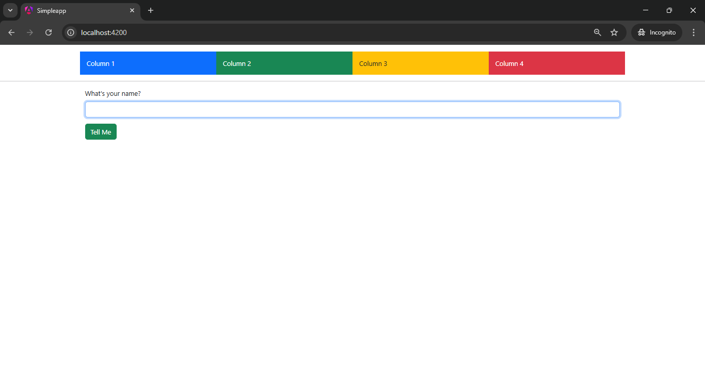
Before Name Entered

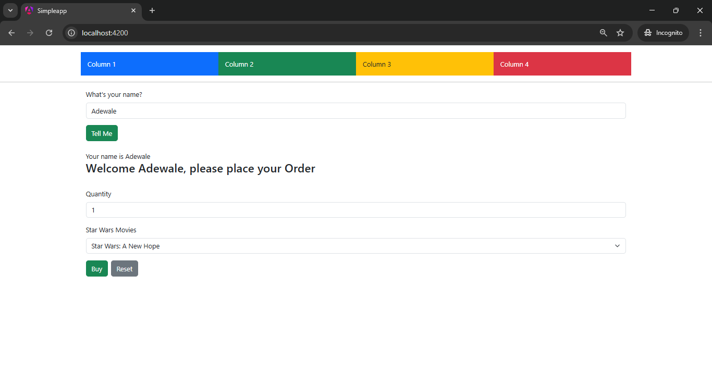
After Name Entered

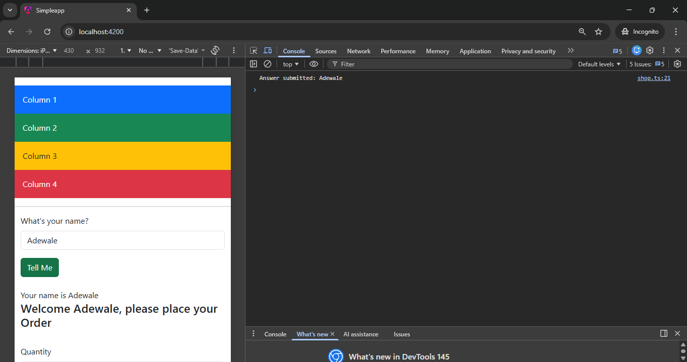
Console Log Output 

**Template Driven Forms (Info Component)**
**Component Overview**

The Info component demonstrates template-driven forms and two-way data binding using Angular’s FormsModule.
FormsModule was imported into the application to enable ngModel usage.

**Properties Implemented**  
The component includes the following properties:
- quantity
- products (array of product names)
- selectedProduct
These properties are bound directly in the template.

**Two-Way Data Binding**  
The syntax:  [(ngModel)]="quantity"  
combines property binding and event binding. It ensures synchronization between user input and component logic.

User interactions:
- Enter quantity → quantity property updates
- Select product → selectedProduct updates
- Click Buy → order details logged to console
- Click Reset → form values cleared

**Parent-Child Communication**

The @Input decorator was used to receive the name value from the Shop component. This demonstrates structured parent-to-child communication.

**Conditional Rendering**

The *ngIf directive was used to ensure that the Info component only displays when a valid name has been entered in the Shop component.

**Concepts Demonstrated**

- Template-driven forms
- Two-way binding
- FormsModule integration
- Component communication using @Input
- Structural directives (*ngIf)
- Event handling

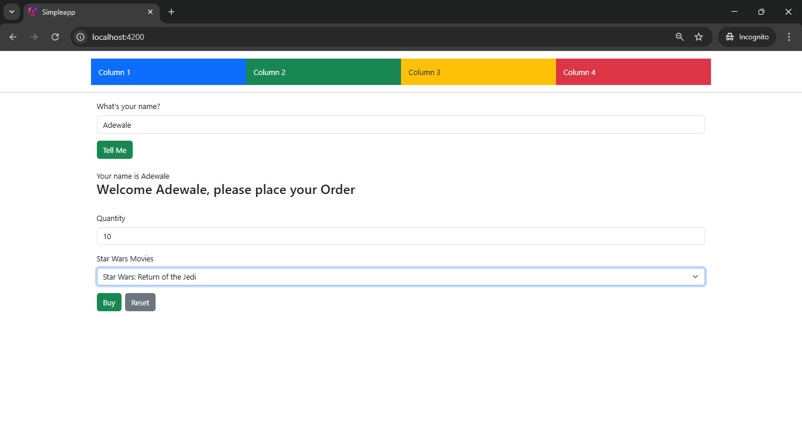
Info Component Display
  
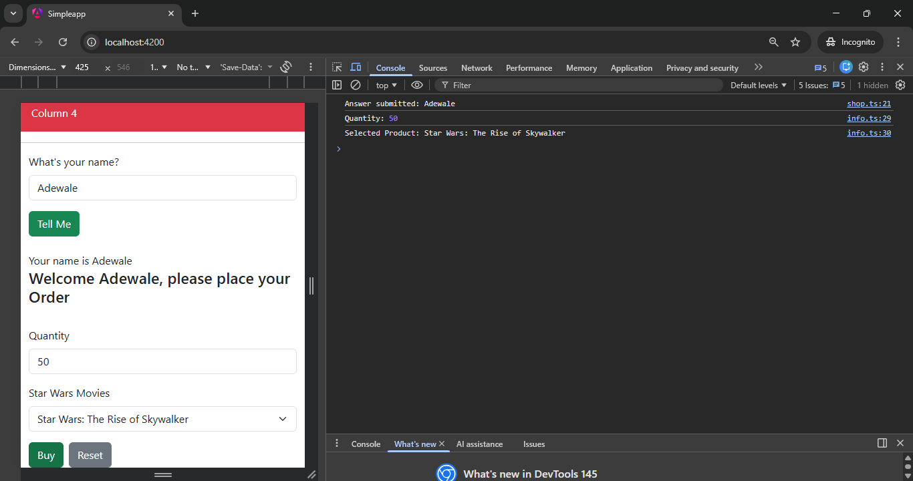
Buy Button Console Output

# Part 1 Research Question Answers
Question 1 – What is the Purpose of the @Input Decorator in Angular?  
**Ans:** The @Input decorator, in Angular is used so that a parent component can send information to a child component. When we build things with Angular we make lots of components that can be used again and again. These components need to talk to each other and share information. The @Input decorator helps us do this by giving us a way to send data from the parent component to the child component. We use this to bind properties.
For example in the Music Application when you pick an artist in the ListArtistsComponent you can send that artist to the ListAlbumsComponent. You do this with the @Input decorator. This way the ListAlbumsComponent can show albums, by the artist you chose without looking at the workings of the parent component. The Music Application uses this to make the ListAlbumsComponent work with the selected artist.

Question 2 – What is [value] Property Binding in Angular?  
**Ans:** In Angular the thing that is written as [value] is what we call property binding syntax. This property binding is something that we use to connect a value from the components TypeScript class to a property of an HTML element that's in the template. We use brackets to tell Angular that it should look at the expression that is, inside the brackets and then bind the result to the HTML element in a dynamic way. The square brackets are important because they tell Angular to do this binding of the value.
For Example: <input [value]="username">

Question 3 – Explain [(ngModel)] and Two-Way Data Binding
The Angular directive called ngModel does a cool thing. It helps the user interface and the component class talk to each other. This is called two-way data binding. The ngModel directive is like a shortcut that combines two things into one: it helps with property binding and event binding. Some people call this the "banana in a box" notation because of how it looks.
Two-way data binding is useful, for a reasons:

* When you update the user interface like when you type something into a field the component property will update on its own.
* When the component property changes, like when you do something in your code the user interface will update on its own. This is what the Angular ngModel directive does. It makes sure that the Angular ngModel directive keeps everything in sync.

**Part 2 – Music Application Architecture**

The Angular Music Application is a Single Page Application (SPA) developed using the Angular framework. The purpose of this project is to demonstrate understanding of Angular architecture, component-based design, routing, data binding, and CRUD operations using fixed (hard-coded) data.
This project simulates a real-world music management system where users can:
- View a list of artists
- Display albums for a selected artist
- View detailed album information including tracks
- Create new albums
- Edit existing albums
- Delete albums

The application is built using standalone Angular components and Bootstrap for styling. It follows a structured component hierarchy and uses a service layer to manage application data.

**Project Objectives**
The primary objectives of this project are:
1. Demonstrate understanding of Angular component architecture.
2. Implement Angular routing for navigation between views.
3. Perform CRUD operations using a service.
4. Apply Angular data binding techniques:
   - Interpolation
   - Property binding
   - Event binding
   - Two-way binding
5. Implement parent-child communication using @Input().
6. Design a responsive user interface using Bootstrap.
This project ensures compliance with all requirements listed in the Activity 3 rubric.
## Project Initialization

A new Angular project named musicapp was created using Angular CLI: ng new musicapp --routing  
Routing was enabled during setup to allow navigation between multiple views. CSS was selected as the styling format.  
Unlike Part 1, this application follows a more structured and modular architecture that simulates a real-world enterprise front-end application.

## Application Structure

The project follows Angular best practices with organized folders:

- components
- models
- service
- data (mock JSON)
- routing configuration  
-  This separation improves maintainability and scalability.

## Mock Data Configuration

Since no live backend API was required for this assignment, local JSON data was used to simulate backend responses.To enable JSON imports, the following TypeScript compiler options were enabled:

- resolveJsonModule
- esModuleInterop

This allowed the application to treat JSON files as modules.

## Architectural Pattern Used

The application follows a façade pattern using a centralized MusicServiceService  
Responsibilities of the service:
- Provide album and artist data
- Handle CRUD operations
- Encapsulate business logic
- Prevent direct data manipulation inside components
This ensures separation of concerns and clean component design.

## Key Angular Features Used

- Standalone Components
- Angular Router
- @Input decorator
- Query Parameters
- Lifecycle Hooks (ngOnChanges)
- Dependency Injection
- Structural Directives (*ngIf, *ngFor)

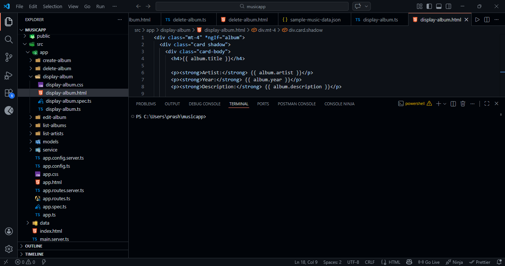
Project Folder Structure

**Application Overview**  
The Angular Music App consists of the following main sections:
1. Navigation Bar
2. Artist List View
3. Album List View
4. Display Album Component
5. Create Album Component
6. Edit Album Component
7. Delete Album Component
8. About Us Page

Each section is accessible through Angular Router navigation, ensuring smooth Single Page Application behavior without full page reloads.

# Technologies Used 
The technologies used in this project include:
- Angular (Standalone Components)
- TypeScript
- HTML5
- CSS3
- Bootstrap
- Angular Router
- Angular Directives (ngIf, ngFor)
- Angular Forms

These technologies were selected to ensure modularity, maintainability, responsiveness, and scalability.

# Application Architecture Overview

The application follows a structured component-based architecture:

App Component  
→ Artist List Component  
→ Album List Component  
→ Display Album Component  

Additional components such as Create, Edit, and Delete interact with the MusicService for data operations. RouterModule manages navigation between pages, while Bootstrap enhances UI styling.
This layered architecture ensures separation of concerns, clean code organization, and easier maintenance.

# Screenshot Placeholders


Full Application Home Page  


 GCU home page  

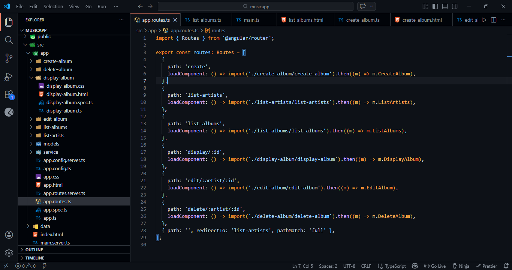
 Navigation Between Pages  


# System Design and Component Architecture

The Angular Music Application follows a modular, component-based architecture. Angular encourages breaking the application into smaller, reusable components. Each component is responsible for a specific part of the user interface and logic.
The application is structured using standalone components instead of traditional NgModules. This modern Angular approach improves maintainability and simplifies dependency management.

# Overall System Structure

The system is organized into three primary layers:

1. Presentation Layer (UI Components)
2. Service Layer (Business Logic & Data Management)
3. Routing Layer (Navigation Control)

These layers work together to ensure clean separation of concerns.

# Component Hierarchy

The hierarchical flow of components in the application is:  App Component  
→ Artist List Component  
→ Album List Component  
→ Display Album Component  

Additional components:
- Create Album Component
- Edit Album Component
- Delete Album Component
- About Us Component  
Each component is responsible for a specific task, reducing complexity and improving readability.

# App Component (Root Component)

The App Component acts as the root of the application. It contains:

- Navigation bar
- Router outlet
- Global layout structure

The `<router-outlet>` directive dynamically loads components based on the current route. This enables Single Page Application behavior without refreshing the browser.

Key Responsibilities:
- Define global navigation
- Control routing flow
- Maintain application title and version

# Artist List Component

The Artist List Component displays all available artists. It serves as the entry point for users to explore albums.

Responsibilities:
- Display artist names
- Handle artist selection
- Pass selected artist to Album List component

Angular features used:
- *ngFor directive for listing artists
- Event binding for click handling
- Property binding for data transfer

This component demonstrates dynamic rendering using Angular structural directives.

  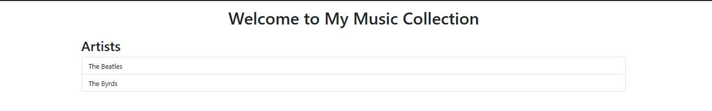
 showing artist list page

# Album List Component

The Album List Component receives the selected artist using the `@Input()` decorator. It loads albums from the MusicService and filters them based on the selected artist.

Important Features:
- Uses `ngOnChanges()` lifecycle hook
- Filters albums using service data
- Implements View, Edit, and Delete buttons
- Uses event binding for selecting albums
The component also conditionally renders the Display Album component using `*ngIf`.
Angular concepts demonstrated:
- Parent-child communication
- Lifecycle hooks
- Conditional rendering
- Dynamic data filtering


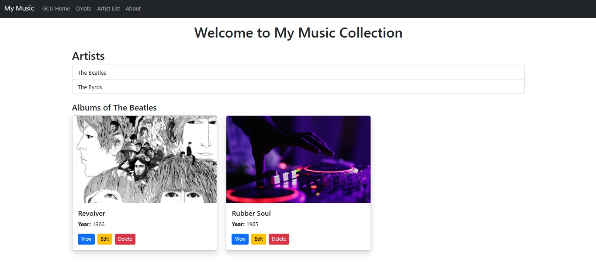]
showing albums displayed for a selected artist

# Display Album Component

The Display Album Component is a child component that receives album data using `@Input()`.

Responsibilities:
- Display album details (title, artist, year, description)
- Display track list using *ngFor
- Render data dynamically

This component demonstrates:
- Component reusability
- Data encapsulation
- Template-driven display logic

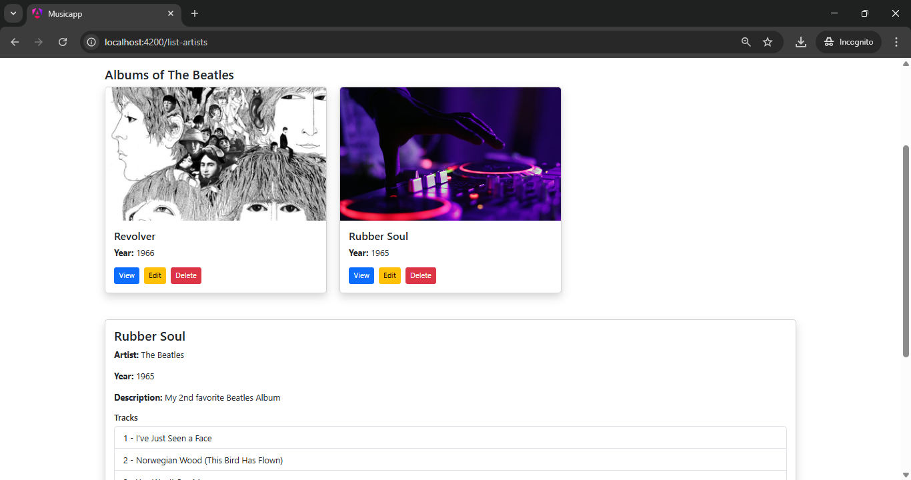
album details and track list of selected artist

# Service Layer – MusicService

The MusicService handles all data-related operations. Since this project uses fixed data, the service contains hard-coded album data.

Responsibilities:
- Store album data
- Return album list
- Add new albums
- Update albums
- Delete albums

Using a service ensures centralized data management and keeps business logic separate from UI components.

Angular concepts demonstrated:
- Dependency Injection
- Service-based architecture
- Reusable data layer

# Routing Design

The application uses Angular Router to navigate between pages. Routes are configured to handle:

- /list-artists
- /create
- /edit/:artist/:albumId
- /delete/:artist/:albumId
- /about

Routing ensures:
- Clean URL structure
- Component-based navigation
- Dynamic parameter handling

This allows the application to pass album-specific data through the URL.

## Query Parameters Handling

Query parameters were used to trigger component reinitialization and ensure data refresh when navigating between pages.

Example usage:
this.router.navigate(['list-artists'], {
  queryParams: { data: new Date() }
});

This ensures the component reloads properly when revisiting the same route.

## Benefits of Angular Routing

- Enables SPA behavior (no full page reload)
- Clean URL management
- Component-based navigation
- Dynamic data passing via parameters
- 
# Bootstrap Navigation Bar
A responsive Bootstrap navigation bar was implemented at the root level of the application.

## Implementation Details

The navbar includes:

- Application title: "My Music Collection"
- Link to Artist List
- Link to Create Album
- About button

Instead of traditional href links, Angular’s routerLink directive was used.

Example:
```html
<a routerLink="/list-artists" routerLinkActive="active">
  Artist List
</a>
```

This ensures SPA navigation without reloading the browser.

## About Button Implementation

The application version was defined as:  version = "1.0"

When the About button is clicked, an alert displays the version number. This demonstrates event binding and method invocation from the template.

## Responsive Behavior

Bootstrap classes such as:

- navbar
- navbar-expand-lg
- navbar-dark
- bg-dark
- container-fluid
were used to ensure responsiveness across devices.

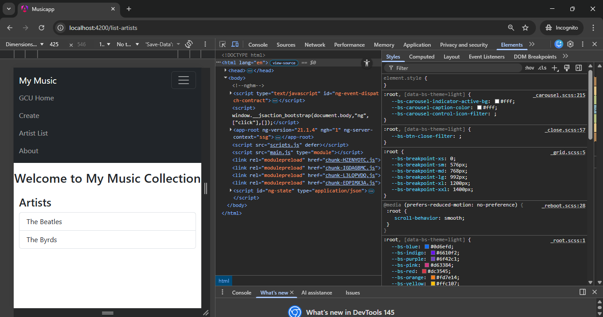
Mobile Navbar View  

# Music Service Implementation

The MusicServiceService acts as a façade layer that manages all album and artist data.

## Responsibilities

- Retrieve artist list
- Retrieve album list
- Retrieve single album
- Create new album
- Update album
- Delete album

## Implemented Methods

- getArtists()
- getAlbums()
- getAlbum()
- createAlbum()
- updateAlbum()
- deleteAlbum()

Array operations such as push() and splice() were used to manage album data locally.

## CRUD Implementation Strategy

Create:
Adds a new album to the array using push().

Read:
Retrieves data using filter() and find().

Update:
Modifies existing album objects using ID matching.

Delete:
Removes album using splice() after locating index.

## Benefits of Service Layer

- Centralized data management
- Improved code organization
- Reusable logic across components
- Easier testing
- Clear separation between UI and business logic

**List Artists Component**

**Component Overview**
The ListArtistsComponent is responsible for retrieving and displaying the list of artists from the MusicServiceService.
The component uses Angular’s dependency injection system to access the service and retrieve artist data.

## Key Responsibilities

- Call getArtists() from the service
- Display artists using *ngFor
- Allow artist selection
- Trigger navigation to album listing
- Subscribe to query parameters for refresh behavior

## Query Parameter Subscription

To ensure the component reloads when navigating back to the same route, query parameters were used.

This ensures:
- Component reinitialization
- Updated UI rendering
- Proper navigation behavior

## Angular Features Used

- Dependency Injection
- *ngFor structural directive
- Router navigation
- Query parameter subscription
---

# List Albums Component

## Component Overview

The ListAlbumsComponent displays albums based on the selected artist.

It receives the artist name using the @Input decorator from the parent component.

## Lifecycle Hook Usage

The ngOnChanges() lifecycle hook is implemented to detect changes in the selected artist.

When the artist changes:
- Albums are filtered using service data
- The album list refreshes dynamically

## Dynamic Rendering

Albums are displayed using *ngFor. Each album card contains:

- Album image
- Title
- Year
- View button
- Edit button
- Delete button

## Conditional Display

The DisplayAlbumComponent is rendered using:

*ngIf="selectedAlbum"

This ensures album details only appear after clicking the View button.

## Concepts Demonstrated

- Parent-child communication
- Lifecycle hooks
- Conditional rendering
- Dynamic filtering
- Event binding
---

## Display Album Component

## Component Overview

The DisplayAlbumComponent receives an Album object as input and displays detailed album information.

It is designed as a reusable child component.

## Data Displayed

- Album title
- Artist name
- Year
- Description
- Track list

The track list is rendered using *ngFor to dynamically loop through the tracks array.

## Angular Concepts Used

- @Input decorator
- *ngFor directive
- Interpolation
- Component reusability
- Encapsulation of presentation logic

This component ensures clean separation between list view and detailed view.


Album List  


Track List Display

---

# Create Album Component

## Component Overview

The Create Album Component allows users to add a new album to the collection.

A form was implemented to collect:

- Artist name
- Album title
- Year
- Description
- Image URL

## Form Handling

Upon form submission:

- Form values are captured
- createAlbum() method in MusicServiceService is called
- The album is added to the internal array using push()
- The UI updates automatically

## Immediate Data Reflection

Since the service stores data in memory, newly created albums appear instantly in the list without page reload.

## Angular Concepts Demonstrated

- Form handling
- Event binding
- Service interaction
- Navigation after creation
- Dynamic data update

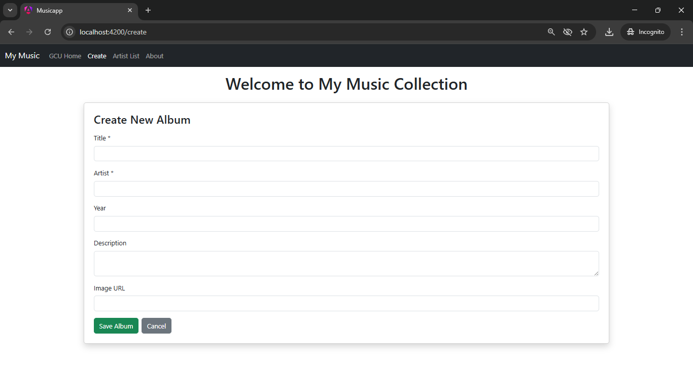
Create Album Form  

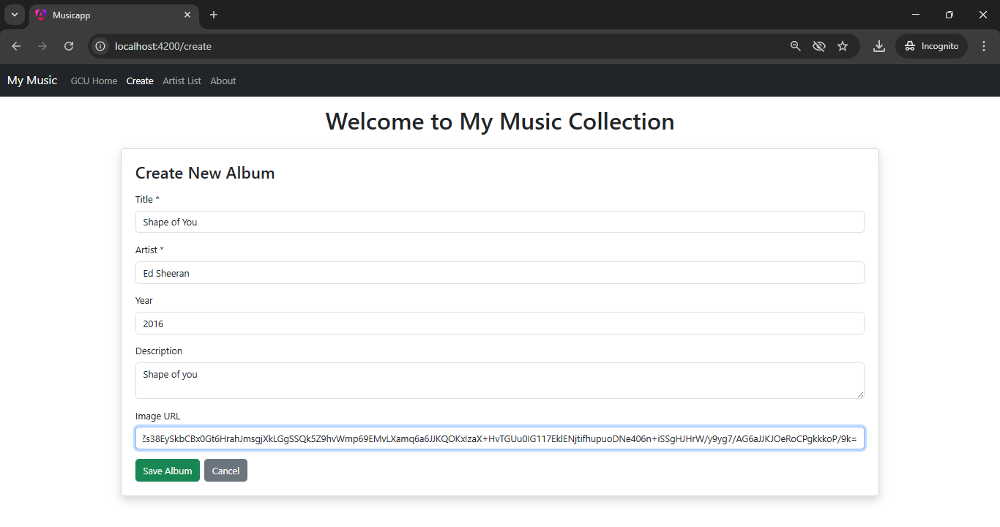
New Record inserting into the list.


New Record Added into the List

---

# About Box Implementation

## Implementation Overview

The About feature was implemented in the navigation bar.

The application includes:

title = "My Music Collection"  
version = "1.0"

When the About button is clicked:

- A method is triggered
- An alert displays the application version

This demonstrates:

- Event binding
- Method invocation
- Template-to-component interaction

## Purpose

The About section provides basic application metadata and improves user experience by offering version visibility.

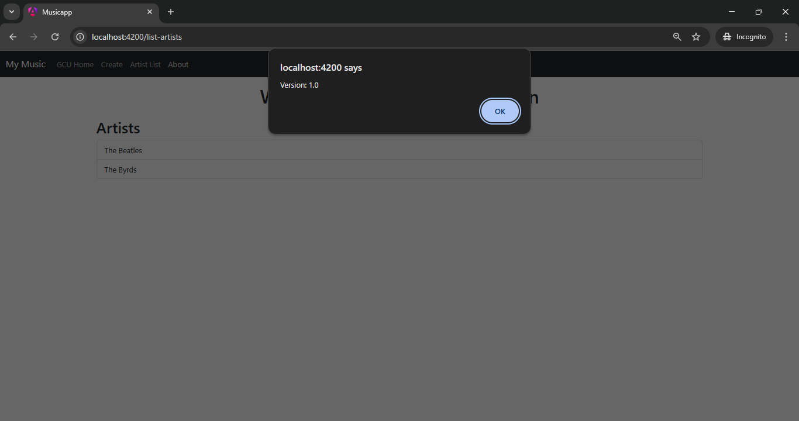
About Alert Popup

---

# Fully Commented Music Service Code

The MusicServiceService centralizes all CRUD logic. Below is a simplified representation with comments:

```typescript
@Injectable({ providedIn: 'root' })
export class MusicServiceService {

  
  getArtists() {
    return [...new Set(this.albums.map(a => a.artist))];
  }

  getAlbums() {
    return this.albums;
  }

  getAlbum(id: number) {
    return this.albums.find(a => a.albumId === id);
  }

  createAlbum(album: Album) {
    this.albums.push(album);
  }


  updateAlbum(updatedAlbum: Album) {
    const index = this.albums.findIndex(a => a.albumId === updatedAlbum.albumId);
    if (index !== -1) {
      this.albums[index] = updatedAlbum;
    }
  }

 
  deleteAlbum(id: number) {
    const index = this.albums.findIndex(a => a.albumId === id);
    if (index !== -1) {
      this.albums.splice(index, 1);
    }
  }
}

